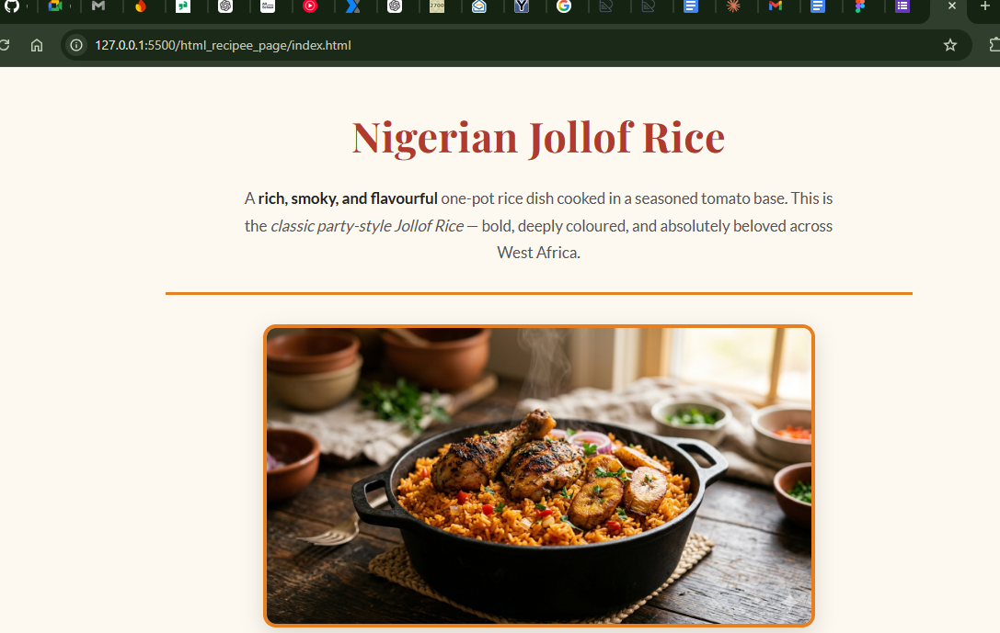
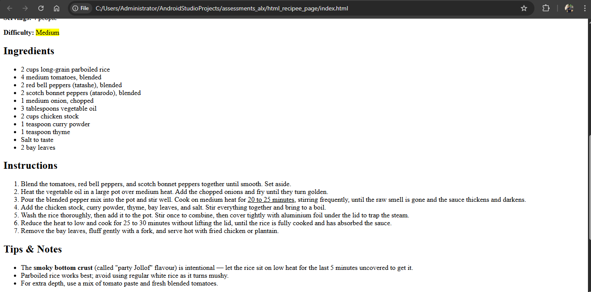
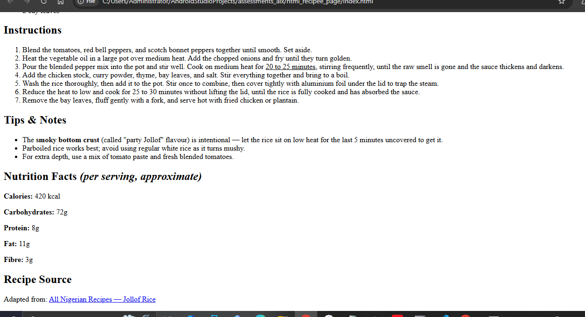

# HTML & CSS Recipe Page — Nigerian Jollof Rice

A styled recipe webpage built across two ALX assessments:
- **Assessment 1** — HTML structure and content
- **Assessment 2** — External CSS styling, layout, and visual design

---

## Screenshots

**Page header and recipe image**


**Recipe details, ingredients, and instructions**


**Tips, nutrition facts, and recipe source**


---

## Live Preview

> Open `index.html` in any modern browser to view the page locally.
> To share publicly, push to GitHub and enable **GitHub Pages** under *Settings → Pages → Deploy from branch (main)*.

---

## Assessment 1 Checklist — HTML Structure (5 Marks)

| # | Criterion | Status |
|---|-----------|--------|
| 1 | Document structure (`<!DOCTYPE>`, `<html>`, `<head>`, `<body>`, `<title>`, `<meta>`) | ✅ |
| 2 | Page content — recipe name, description, details, ingredients (≥ 6), instructions (≥ 5), tips | ✅ |
| 3 | Image with `src`, `alt`, and size attributes | ✅ |
| 4 | Text formatting — `<strong>`, `<em>`, `<u>`, `<mark>` | ✅ |
| 5 | Code validity & readability — indentation and section comments | ✅ |
| 6 | Bonus — recipe source link, Nutrition Facts section, `<section>` & `<article>` elements | ✅ |

---

## Assessment 2 Checklist — CSS Styling (5 Marks)

| # | Criterion | Status |
|---|-----------|--------|
| 1 | External stylesheet (`style.css`) linked via `<link>` tag — no inline styles | ✅ |
| 2 | Typography & colors — Playfair Display headings, Lato body font, warm red/orange/green palette | ✅ |
| 3 | Layout — CSS Grid for recipe details (4-column), Flexbox for nutrition fact pills | ✅ |
| 4 | Spacing & alignment — consistent padding, margins, and gap across all sections | ✅ |
| 5 | Styling details — card borders, box-shadows, hover lift effect on detail cards, link colour transition | ✅ |

---

## Project Structure

```
html_recipee_page/
├── index.html        # Recipe page markup
├── style.css         # External stylesheet
├── jollof-rice.jpg   # Recipe image
├── image.png         # Screenshot 1
├── image-1.png       # Screenshot 2
├── image-2.png       # Screenshot 3
└── README.md         # Project documentation
```

---

## Design Highlights

- **Color palette** — deep tomato red (`#b03a2e`), warm orange (`#e67e22`), fresh green (`#1e8449`), cream background (`#fef9f0`) — all inspired by the dish itself
- **Grid layout** — recipe details displayed as a 4-card CSS Grid row that collapses to 2 columns on small screens
- **Flexbox layout** — nutrition facts arranged as wrapping flex pills
- **Hover effects** — detail cards lift on hover with a smooth `transform + box-shadow` transition
- **Tips section** — styled with a thick left orange border for visual distinction
- **Nutrition section** — green-bordered card with individual stat pills on a mint background

---

## Author

**Damilare** — ALX Software Engineering Programme
HTML & CSS Fundamentals Assessments, April–May 2026
