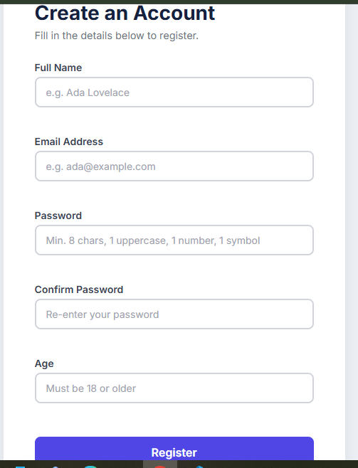
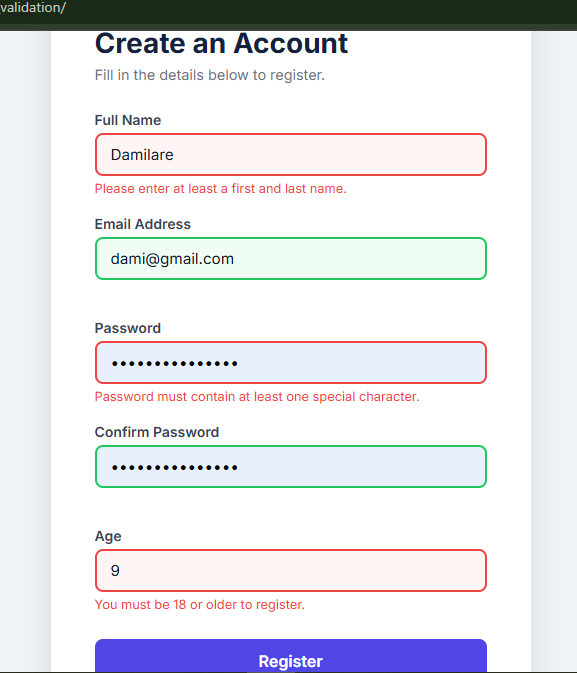
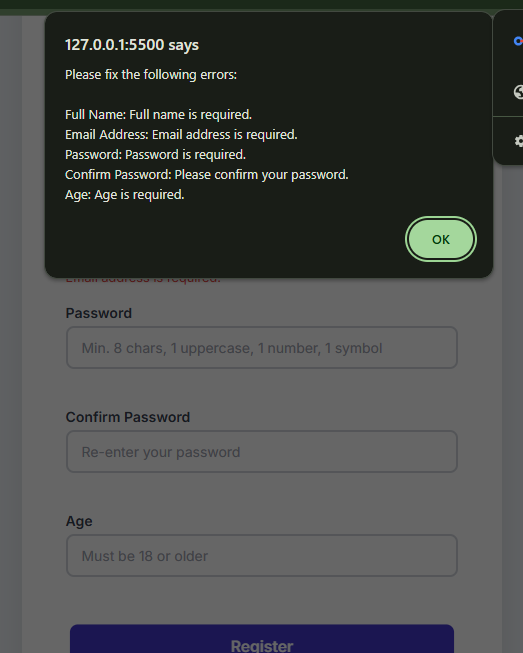

# JavaScript Form Validation — User Registration

A user registration form built as part of the **ALX JavaScript Fundamentals Assessment**.  
The form validates all five input fields using JavaScript before allowing submission.

---

## Screenshots

**1**


**2**


**3e**


---

## Live Preview

> Open `index.html` directly in any modern browser (double-click the file).  


---

## Assessment Criteria Checklist

| # | Criterion | Status |
|---|-----------|--------|
| 1 | HTML Structure — properly labelled form with all 5 required fields | ✅ |
| 2 | Validation Logic — correct JavaScript rules for all 5 fields | ✅ |
| 3 | Error/Success Feedback — `alert()` for errors, success alert + on-page banner | ✅ |
| 4 | Code Quality — clean, commented, and well-organised JS and HTML | ✅ |
| 5 | Bonus — real-time validation on `blur` with green/red border visual feedback | ✅ |

---

## Validation Rules

| Field | Rule |
|---|---|
| Full Name | Must not be empty and must contain at least 2 words |
| Email Address | Must match valid email format (`name@domain.com`) |
| Password | Min. 8 characters, one uppercase letter, one number, one special character |
| Confirm Password | Must exactly match the Password field |
| Age | Must be 18 or older |

---

## How It Works

1. **On blur** (leaving a field) — the field is validated immediately. A red border and inline error message appear if invalid; a green border appears if valid.
2. **On submit** — all fields are re-validated. If any fail, a single `alert()` lists every error and stops submission.
3. **On success** — a success `alert()` fires, and a green banner appears below the form.

---

## Project Structure

```
javascript_form_validation/
├── index.html    # Registration form markup
├── script.js     # Validation logic and event handlers
├── style.css     # Form styling and validation state styles
└── README.md     # Project documentation
```

---

## Author

**Damilare** — ALX Software Engineering Programme  
JavaScript Fundamentals Assessment, May 2026
