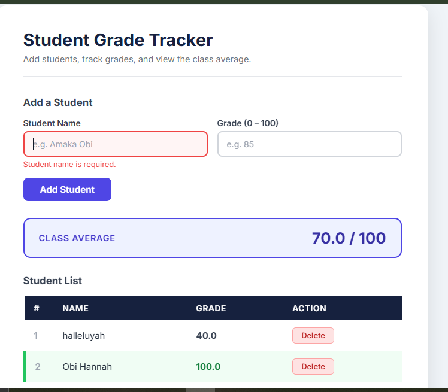

# Student Grade Tracker

A dynamic student grade tracking web app built as part of the **ALX JavaScript Fundamentals Assessment**.  
Uses JavaScript arrays and objects to manage student data, with full DOM manipulation for live updates.

---

## Screenshots

**App overview**


---

## Live Preview

> Open `index.html` directly in any modern browser (double-click the file).  

---

## Assessment Criteria Checklist

| # | Criterion | Status |
|---|-----------|--------|
| 1 | Data Structure — students stored as array of `{ id, name, grade }` objects | ✅ |
| 2 | DOM Manipulation — table updates live on add/delete, average recalculates instantly | ✅ |
| 3 | Event Handling — Add Student form submit + delegated Delete button click | ✅ |
| 4 | Input Validation — name required, grade must be a number between 0 and 100 | ✅ |
| 5 | Bonus — above-average row highlighting + localStorage persistence across reloads | ✅ |

---

## Features

| Feature | Detail |
|---|---|
| Add student | Enter name + grade; validated before adding to the list |
| Live table | Student list renders instantly; row numbers auto-update on delete |
| Class average | Calculated from all current students; hidden when list is empty |
| Delete student | Removes from array and DOM; average recalculates immediately |
| Above-average highlight *(bonus)* | Students scoring above the class average get a green row highlight |
| Persistent storage *(bonus)* | Data saved to `localStorage` — survives page refresh |
| Real-time validation | Red/green border feedback as you leave each input field |

---

## Project Structure

```
student_grade_tracker/
├── index.html    # App markup — form, table, average card
├── script.js     # Data management, rendering, event handling
├── style.css     # Layout, table styles, validation states
├── image_1.png   # Screenshot
└── README.md     # Project documentation
```

---

## Author

**Damilare** — ALX Software Engineering Programme  
JavaScript Fundamentals Assessment, May 2026
