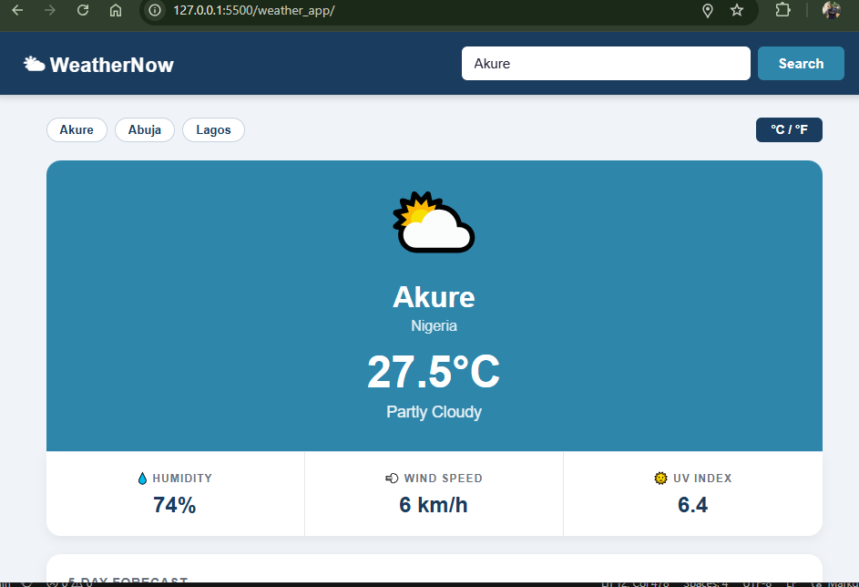
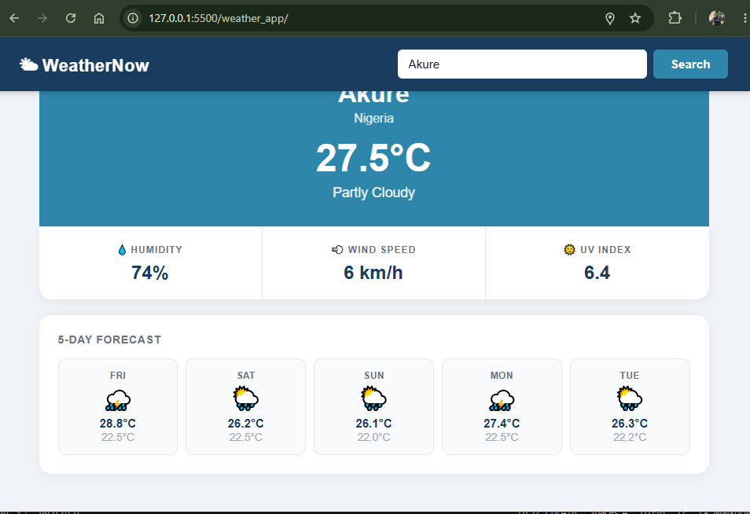

# WeatherNow — Weather App

**Student:** Damilare  
**Student ID:** ALT/SOE/BAR/026/0203  
**Course:** WEB 100–106 | ALX School of Engineering  
**Submission Deadline:** 23rd June, 2026

---

## Description

This Weather App was built using HTML, CSS, and vanilla JavaScript. It fetches live weather data from the free Open-Meteo API (no API key required). The user enters a city name; the app first calls the Open-Meteo Geocoding API to convert the city name into coordinates, then calls the Forecast API to retrieve the current temperature, humidity, wind speed, UV index, and a 5-day daily forecast. All API calls use async/await with proper error handling. The UI matches the required design specification — navy header, teal hero section, three-column stats row, and a five-card forecast grid — and is fully responsive down to 480px. Four bonus features are also implemented: automatic geolocation on page load, a °C/°F unit toggle, a localStorage-backed search history bar, and CSS keyframe animations on the hero weather icon.

---

## Screenshots

**App — current weather view**


**App — 5-day forecast and stats**


---

## Live Demo

> [GitHub Pages link here after deployment]

---

## Technical Requirements Checklist

### HTML Structure
| Requirement | Where it is | Status |
|---|---|---|
| Search input field and Search button | `<header>` → `.search-group` in `index.html` | ✅ |
| Display area for city name, country, temperature, description | `<section id="hero">` in `index.html` | ✅ |
| Stats row — humidity, wind speed, UV index | `<section id="stats">` with three `.stat-card` divs | ✅ |
| Forecast section — dynamically shows 5 days | `<section id="forecast">` → `#forecastGrid` filled by JS | ✅ |
| Visible error message area | `<div id="errorMsg">` — shown/hidden by `showError()` | ✅ |
| Semantic tags — `<header>`, `<main>`, `<section>` | Used throughout `index.html` | ✅ |
| `<script>` tag at the bottom of `<body>` | Last line before `</body>` in `index.html` | ✅ |

### CSS Styling
| Requirement | Where it is | Status |
|---|---|---|
| Exact colours — `#1A3C5E` header, `#2E86AB` hero | `#navbar` and `#hero` rules in `styles.css` | ✅ |
| Responsive layout | Flexbox header, CSS Grid stats/forecast in `styles.css` | ✅ |
| Media query for screens narrower than 480px | `@media (max-width: 480px)` block in `styles.css` | ✅ |
| Hover effect on Search button | `#searchBtn:hover` rule in `styles.css` | ✅ |
| Hover effect on forecast rows | `.forecast-card:hover` rule in `styles.css` | ✅ |
| Loading state | `#loadingMsg` shown via `.hidden` utility class | ✅ |
| Smooth transition `transition: all 0.2s ease` | On `#searchBtn`, `.forecast-card`, `.history-chip` | ✅ |

### JavaScript Functionality
| Requirement | Where it is | Status |
|---|---|---|
| `async function getCoordinates(city)` | Line ~46 in `script.js` — calls Geocoding API | ✅ |
| `async function getWeather(lat, lon)` | Line ~75 in `script.js` — calls Forecast API | ✅ |
| Display city name, country, temperature, description | `displayCurrentWeather()` in `script.js` | ✅ |
| Display humidity, wind speed, UV index | `displayCurrentWeather()` — updates stat cards | ✅ |
| Display 5-day forecast (day, icon, high, low) | `displayForecast()` in `script.js` | ✅ |
| Handle errors gracefully | `showError()` + try/catch in `handleSearch()` | ✅ |
| Use `async/await` throughout (no `.then()` chains) | All API functions use `async/await` | ✅ |
| Comments on every function | Every function has a block comment above it | ✅ |

---

## Assessment Criteria Coverage

| Criteria | Marks | How it is met |
|---|---|---|
| HTML Structure | 6 | Semantic tags, all required containers, script at bottom of body |
| CSS Styling | 6 | Exact required colours, responsive grid, hover effects, transitions, media query at 480px |
| JavaScript Logic | 7.5 | Two-step API fetch (geocoding → forecast), full DOM updates, async/await, error handling |
| UI Accuracy | 6.5 | Navy nav bar, teal hero, 3-column stats attached below hero, 5-column forecast grid on white |
| Code Readability | 3 | Every function has a descriptive block comment; clear variable names; sections separated by comment headers |
| Bonus Features | 1 | All 4 bonus features implemented (see below) |

---

## Bonus Features Implemented

| Bonus | Marks | Implementation |
|---|---|---|
| Geolocation | 2 pts | `handleGeolocation()` — calls `navigator.geolocation` on page load, loads weather silently |
| Unit toggle | 1 pt | `toggleUnit()` — switches °C/°F and re-renders using stored data, no re-fetch |
| Search history | 1 pt | `addToHistory()` + `renderHistory()` — last 5 cities saved to `localStorage` as chip buttons |
| Animated weather icon | 1 pt | `@keyframes spin/bounce/pulse` in `styles.css` — class applied to hero icon by weather type |

---

## Tech Stack

- **HTML5** — semantic structure (`<header>`, `<main>`, `<section>`)
- **CSS3** — Grid, Flexbox, keyframe animations, media queries
- **JavaScript (ES6+)** — async/await, Fetch API, DOM manipulation, localStorage
- **Open-Meteo API** — free, open-source, no API key required

---

## API Reference

| API | URL |
|---|---|
| Geocoding (city → coordinates) | `https://geocoding-api.open-meteo.com/v1/search` |
| Forecast (coordinates → weather) | `https://api.open-meteo.com/v1/forecast` |

---

## Project Structure

```
weather_app/
├── index.html      # App layout — header, hero, stats, forecast
├── styles.css      # All styling — colours, grid, animations, responsive
├── script.js       # API calls, DOM updates, all bonus features
├── weather_1.png   # Screenshot 1
├── weather_2.png   # Screenshot 2
└── README.md       # Project documentation
```
